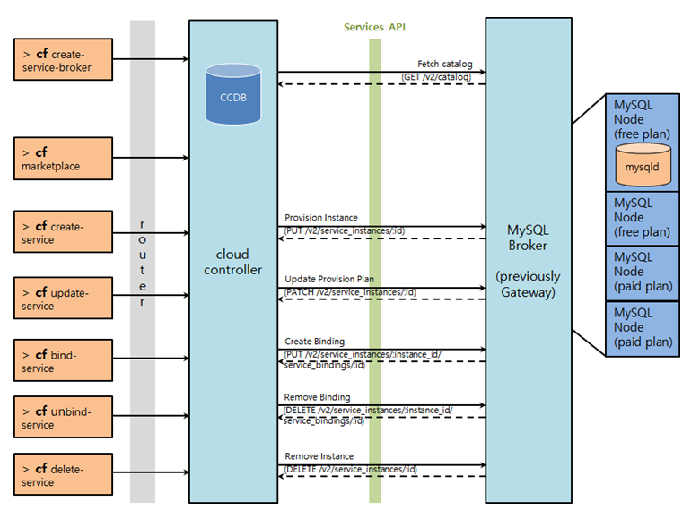

### [Index](https://github.com/PaaS-TA/Guide/blob/master/README.md) > [AP Architecture](../README.md) > Open Service Broker

## 목적

본 문서 Open service Broker 개념에 대하여 간단하게 소개한다.

## 서비스 Architecture
서비스 브로커는 서비스 offering 및 서비스 Plan 기반으로  서비스 카탈로그를 공개하고 사용자의 행위에 따라 서비스 프로비저닝, 서비스 바인딩, 서비스 바인딩 해제 및 프로비저닝 해제 요청을 수행한다.
 
일반적으로 'provision'은 서비스에 리소스를 선점하고 'bind'는 해당 리소스에 액세스하는 데 필요한 정보를 앱에 전달한다. 선점된 리소스를 서비스 인스턴스라고 한다.
 
서비스 인스턴스가 나타내는 내용은 서비스에 따라 다를 수 있습니다. 예를들어 멀티 테넌트(Multi-tenant) 서버, 전용 클러스터, 웹 앱의 계정에서 단일 데이터베이스일 수 있다.

## Service Broker API Architecture
Open Service Broker API 는 Cloud Controller와 Service Broker 사이의 규약을 정의한다. Broker는 HTTP (or HTTPS) endpoints URI 형식으로 구현된다. 하나 이상의 Service가 하나의 Broker 에 의해 제공 될 수 있고, 로드 밸런싱이 가능하게 수평 확장성 있게 제공 될 수 있다.

## 참고 자료
http://docs.cloudfoundry.org/services/  
https://github.com/openservicebrokerapi  
https://github.com/cloudfoundry/pxc-release  
https://github.com/PaaS-TA/OPENPAAS-SERVICE-JAVA-BROKER-MYSQL
