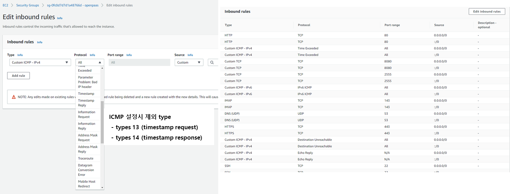

### [Index](https://github.com/K-PaaS/Guide/blob/master/README.md) > [AP Install](../README.md) > BOSH

## Table of Contents

1. [개요](#1)  
 1.1. [목적](#1.1)  
 1.2. [범위](#1.2)  
 1.3. [참고 자료](#1.3)  
2. [BOSH 설치 환경 구성 및 설치](#2)  
 2.1. [BOSH 설치 절차](#2.1)  
 2.2. [Inception 서버 구성](#2.2)  
 2.3. [BOSH 설치](#2.3)  
　2.3.1. [Prerequisite](#2.3.1)  
　2.3.2. [BOSH CLI 및 Dependency 설치](#2.3.2)  
　2.3.3. [설치 파일 다운로드](#2.3.3)  
　2.3.4. [BOSH 설치](#2.3.4)  
　　2.3.4.1. [BOSH 설치 Variable 파일](#2.3.4.1)  
　　2.3.4.2. [BOSH 설치 Option 파일](#2.3.4.2)  
　　2.3.4.3. [BOSH 설치 Shell Script](#2.3.4.3)  
　2.3.5. [BOSH 설치](#2.3.5)  
　2.3.6. [BOSH 로그인](#2.3.6)  
3. [BOSH Option 파일 활용](#3)  
 3.1. [CredHub](#3.1)   
　 3.1.1. [CredHub CLI 설치](#3.1.1)  
　 3.1.2. [CredHub 로그인](#3.1.2)  
 3.2. [Jumpbox](#3.2)   
4. [기타](#4)  
 4.1. [BOSH 로그인 생성 스크립트](#4.1)   

## Executive Summary

본 문서는 BOSH2(이하 BOSH)의 설치 가이드 문서로, BOSH를 실행할 수 있는 환경을 구성하고 사용하는 방법에 관해서 설명하였다.

# <div id='1'/>1. 문서 개요

## <div id='1.1'/>1.1. 목적
클라우드 환경에 서비스 시스템을 배포할 수 있는 BOSH는 릴리즈 엔지니어링, 개발, 소프트웨어 라이프사이클 관리를 통합한 오픈소스 프로젝트로 본 문서에서는 Inception 환경(설치환경)에서 BOSH를 설치하는 데 그 목적이 있다.

## <div id='1.2'/>1.2. 범위
본 문서는 Linux 환경(Ubuntu 22.04)을 기준으로 BOSH 설치를 위한 패키지와 라이브러리를 설치 및 구성하고, 이를 이용하여 BOSH를 설치하는 것을 기준으로 작성하였다.
BOSH는 VMware vSphere, Google Cloud Platform, Amazon Web Services EC2, OpenStack, Microsoft Azure 등의 IaaS를 지원하며, 검증한 IaaS 환경은 OpenStack, vSphere 환경이다.

## <div id='1.3'/>1.3. 참고 자료

본 문서는 Cloud Foundry의 BOSH Document와 Cloud Foundry Document를 참고로 작성하였다.

BOSH Document: [http://bosh.io](http://bosh.io)  
BOSH Deployment: [https://github.com/cloudfoundry/bosh-deployment](https://github.com/cloudfoundry/bosh-deployment)  
Cloud Foundry Document: [https://docs.cloudfoundry.org](https://docs.cloudfoundry.org)  


# <div id='2'/>2. BOSH 설치 환경 구성 및 설치

## <div id='2.1'/>2.1. BOSH 설치 절차
Inception(K-PaaS 설치 환경)은 BOSH 및 K-PaaS를 설치하기 위한 설치 환경으로, VM 또는 서버 장비이다.  
OS Version은 Ubuntu 22.04를 기준으로 한다. IaaS에서 수동으로 Inception VM을 생성해야 한다.

Inception VM은 Ubuntu 22.04, vCPU 2 Core, Memory 4G, Disk 100G 이상을 권고한다.

## <div id='2.2'/>2.2.  Inception 서버 구성

Inception 서버는 BOSH 및 K-PaaS를 설치하기 위해 필요한 패키지 및 라이브러리, Manifest 파일 등의 환경을 가지고 있는 배포 작업 실행 서버이다.  
Inception 서버는 외부 통신이 가능해야 한다.

BOSH 및 Application Platform (이하 AP) 설치를 위해 Inception 서버에 구성해야 할 컴포넌트는 다음과 같다.

- BOSH CLI 6.1.x 이상
- BOSH Dependency : ruby, ruby-dev, openssl 등
- BOSH Deployment: BOSH 설치를 위한 manifest deployment  
- AP Deployment : Application Platform 설치를 위한 manifest deployment

## <div id='2.3'/>2.3.  BOSH 설치

### <div id='2.3.1'/>2.3.1.    Prerequisite

- 본 설치 가이드는 Ubuntu 22.04 버전을 기준으로 한다.  

- IaaS Security Group의 열어줘야할 Port를 설정한다.

|포트|비고|
|---|---|
|22|BOSH 사용|
|6868|BOSH 사용|
|25555|BOSH 사용|
|53|AP 사용|
|68|AP 사용|
|80|AP 사용|
|443|AP 사용|
|4443|AP 사용|


- IaaS Security Group의 inbound 의 ICMP types 13 (timestamp request), types 14 (timestamp response) Rule을 비활성화 한다. (CVE-1999-0524 ICMP timestamp response 보안 이슈 적용)  

  예 - AWS security group config)  
    


### <div id='2.3.2'/>2.3.2.    BOSH CLI 및 Dependency 설치

- BOSH Dependency 설치 (Ubuntu 22.04)

```
$ sudo apt-get update
$ sudo apt-get install -y build-essential zlib1g-dev ruby ruby-dev openssl libxslt1-dev libxml2-dev libssl-dev libreadline-dev libyaml-dev libsqlite3-dev sqlite3
```

- BOSH Dependency 설치 (Ubuntu 20.04)

```
$ sudo apt-get update
$ sudo apt install -y build-essential zlibc zlib1g-dev ruby ruby-dev openssl libxslt1-dev libxml2-dev libssl-dev  libreadline-dev libyaml-dev libsqlite3-dev sqlite3
```

- BOSH CLI 설치

```
$ mkdir -p ~/workspace
$ cd ~/workspace
$ sudo apt update
$ curl -Lo ./bosh https://github.com/cloudfoundry/bosh-cli/releases/download/v6.4.7/bosh-cli-6.4.7-linux-amd64
$ chmod +x ./bosh
$ sudo mv ./bosh /usr/local/bin/bosh
$ bosh -v
```

BOSH2 CLI는 BOSH 설치 시, BOSH certificate 정보를 생성해 주는 기능이 있다.  
Cloud Foundry의 기본 BOSH CLI는 인증서가 1년으로 제한되어 있다.  
BOSH 인증서는 BOSH 내부 Component 간의 통신 시 필요한 certificate이다.  
만약 BOSH 설치 후 1년이 지나면 인증서의 갱신이 필요하다.  
- certificate 갱신 가이드 영상 - [링크](https://youtu.be/zn8VO-fHAFE?t=1994)

### <div id='2.3.3'/>2.3.3.    설치 파일 다운로드

- BOSH를 설치하기 위한 deployment가 존재하지 않는다면 다운로드 받는다
```
$ mkdir -p ~/workspace
$ cd ~/workspace
$ git clone https://github.com/K-PaaS/ap-deployment.git -b v5.8.11
```

- ap-deployment 이하 폴더 확인

```
$ cd ~/workspace/ap-deployment
$ ls
README.md  bosh  cloud-config  ap
```

<table>
<tr>
<td>bosh</td>
<td>BOSH 설치를 위한 manifest 및 설치 파일이 존재하는 폴더</td>
</tr>
<tr>
<td>cloud-config</td>
<td>VM 배포를 위한 IaaS network, storage, vm 관련 설정 파일이 존재하는 폴더</td>
</tr>
<tr>
<td>ap</td>
<td>AP 설치를 위한 manifest 및 설치 파일이 존재하는 폴더</td>
</tr>
</table>


### <div id='2.3.4'/>2.3.4.    BOSH 설치 파일

~/workspace/ap-deployment/bosh 폴더에는 BOSH 설치를 위한 IaaS별 Shell Script 파일이 존재한다.  

Shell Script 파일을 이용하여 BOSH를 설치한다.
파일명은 deploy-{IaaS}.sh 로 만들어졌다.  
또한 {IaaS}-vars.yml을 수정하여 BOSH 설치 시 적용하는 변수을 설정할 수 있다.

<table>
<tr>
<td>aws-vars.yml</td>
<td>AWS 환경에 BOSH 설치 시 적용하는 변수 설정 파일</td>
</tr>
<tr>
<td>azure-vars.yml</td>
<td>Azure 환경에 BOSH 설치 시 적용하는 변수 설정 파일</td>
</tr>
<tr>
<td>gcp-vars.yml</td>
<td>GCP 환경에 BOSH 설치 시 적용하는 변수 설정 파일</td>
</tr>
<tr>
<td>openstack-vars.yml</td>
<td>OpenStack 환경에 BOSH 설치 시 적용하는 변수 설정 파일</td>
</tr>
<tr>
<td>vsphere-vars.yml</td>
<td>vSphere 환경에 BOSH 설치 시 적용하는 변수 설정 파일</td>
</tr>
<tr>
<td>deploy-aws.sh</td>
<td>AWS 환경에 BOSH 설치를 위한 Shell Script 파일</td>
</tr>
<tr>
<td>deploy-azure.sh</td>
<td>Azure 환경에 BOSH 설치를 위한 Shell Script 파일</td>
</tr>
<tr>
<td>deploy-gcp.sh</td>
<td>GCP 환경에 BOSH 설치를 위한 Shell Script 파일</td>
</tr>
<tr>
<td>deploy-openstack.sh</td>
<td>OpenStack 환경에 BOSH 설치를 위한 Shell Script 파일</td>
</tr>
<tr>
<td>deploy-vsphere.sh</td>
<td>vSphere 환경에 BOSH 설치를 위한 Shell Script 파일</td>
</tr>
<tr>
<td>bosh.yml</td>
<td>BOSH를 생성하는 Manifest 파일</td>
</tr>
</table>


#### <div id='2.3.4.1'/>2.3.4.1. BOSH 설치 Variable File 설정

BOSH를 설치하는 IaaS환경에 맞춰서 Variable File을 설정한다.

- AWS 환경 설치 시 

> $ vi ~/workspace/ap-deployment/bosh/aws-vars.yml
```
# BOSH VARIABLE
bosh_client_admin_id: "admin"				# Bosh Client Admin ID
private_cidr: "10.0.1.0/24"					# Private IP Range
private_gw: "10.0.1.1"							# Private IP Gateway
bosh_ip: "10.0.1.6"									# Private IP 	
director_name: "micro-bosh"					# BOSH Director Name
access_key_id: "XXXXXXXXXXXXXXX"		# AWS Access Key
secret_access_key: "XXXXXXXXXXXXX"	# AWS Secret Key
region: "ap-northeast-2"						# AWS Region
az: "ap-northeast-2a"								# AWS AZ Zone
default_key_name: "aws-ap"					# AWS Key Name
default_security_groups: ["bosh"]		# AWS Security-Group
subnet_id: "ap-subnet"							# AWS Subnet
private_key: "~/.ssh/aws-ap.pem"		# SSH Private Key Path

# MONITORING VARIABLE(K-PaaS Monitoring을 설치할 경우 수정)
metric_url: "10.0.161.101"          # influxdb IP
syslog_address: "10.0.121.100"      # td-agent IP
syslog_port: "2514"                 # td-agent Port
syslog_transport: "udp"             # td-agent Logging Protocol
```
- Azure 환경 설치 시 

> $ vi ~/workspace/ap-deployment/bosh/azure-vars.yml
```
# BOSH VARIABLE
bosh_client_admin_id: "admin"														# Bosh Client Admin ID
private_cidr: "10.0.1.0/24"															# Private IP Range
private_gw: "10.0.1.1"																	# Private IP Gateway
bosh_ip: "10.0.1.6"																			# Private IP
director_name: "micro-bosh"															# BOSH Director Name
vnet_name: "ap-bosh-net"																# Azure VNet Name
subnet_name: "ap-subnet"																# Azure VNet Subnet Name
subscription_id: "XXXXXXXX-XXXX-XXXX-XXXX-XXXXXXXXXXXX"	# Azure Subscription ID
tenant_id: "XXXXXXXX-XXXX-XXXX-XXXX-XXXXXXXXXXXX"				# Azure Tenant ID
client_id: "XXXXXXXX-XXXX-XXXX-XXXX-XXXXXXXXXXXX"				# Azure Client ID
client_secret: "client-secret"													# Azure Client Secret
resource_group_name: "ap-bosh-group"										# Azure Resource Group
storage_account_name: "ap-store"												# Azure Storage Account
default_security_group: "ap-security"										# Azure Security Group

# MONITORING VARIABLE(K-PaaS Monitoring을 설치할 경우 수정)
metric_url: "10.0.161.101"          # influxdb IP
syslog_address: "10.0.121.100"      # td-agent IP
syslog_port: "2514"                 # td-agent Port
syslog_transport: "udp"             # td-agent Logging Protocol
```

- GCP 환경 설치 시 

> $ vi ~/workspace/ap-deployment/bosh/gcp-vars.yml
```
# BOSH VARIABLE
bosh_client_admin_id: "admin"				# Bosh Client Admin ID
director_name: "micro-bosh"					# BOSH Director Name
private_cidr: "10.0.1.0/24"					# Private IP Range
private_gw: "10.0.1.1"							# Private IP Gateway
bosh_ip: "10.0.1.6"									# Private IP
network: "public-bosh"							# GCP Network Name
subnetwork: "public-bosh-subnet"		# GCP Subnet Name
tags: ["ap-security"]		        		# GCP Tags
project_id: "ap-project"						# GCP Project ID
zone: "asia-northeast1-a"						# GCP Zone

# MONITORING VARIABLE(K-PaaS Monitoring을 설치할 경우 수정)
metric_url: "10.0.161.101"          # influxdb IP
syslog_address: "10.0.121.100"      # td-agent IP
syslog_port: "2514"                 # td-agent Port
syslog_transport: "udp"             # td-agent Logging Protocol
```

- OpenStack 환경 설치 시

> $ vi ~/workspace/ap-deployment/bosh/openstack-vars.yml
```
# BOSH VARIABLE
bosh_client_admin_id: "admin"				# Bosh Client Admin ID
director_name: "micro-bosh"					# BOSH Director Name
private_cidr: "10.0.1.0/24"					# Private IP Range
private_gw: "10.0.1.1"							# Private IP Gateway
bosh_ip: "10.0.1.6"									# Private IP 
auth_url: "http://XX.XXX.XX.XX:XXXX/v3/"	# Openstack Keystone URL
az: "nova"													# Openstack AZ Zone
default_key_name: "ap"							# Openstack Key Name
default_security_groups: ["ap"]			# Openstack Security Group
net_id: "XXXXXXXX-XXXX-XXXX-XXXX-XXXXXXXXXXXX"	# Openstack Network ID
openstack_password: "XXXXXX"				# Openstack User Password
openstack_username: "XXXXXX"				# Openstack User Name
openstack_domain: "XXXXXXX"					# Openstack Domain Name
openstack_project: "ap"							# Openstack Project
private_key: "~/.ssh/id_rsa.pem"		# Openstack Region
region: "RegionOne"									# SSH Private Key Path

# MONITORING VARIABLE(K-PaaS Monitoring을 설치할 경우 수정)
metric_url: "10.0.161.101"          # influxdb IP
syslog_address: "10.0.121.100"      # td-agent IP
syslog_port: "2514"                 # td-agent Port
syslog_transport: "udp"             # td-agent Logging Protocol
```

- vSphere 환경 설치 시

> $ vi ~/workspace/ap-deployment/bosh/vsphere-vars.yml
```
# BOSH VARIABLE
bosh_client_admin_id: "admin"				# Bosh Client Admin ID
director_name: "micro-bosh"					# BOSH Director Name
private_cidr: "10.0.1.0/24"					# Private IP Range
private_gw: "10.0.1.1"							# Private IP Gateway
bosh_ip: "10.0.1.6"									# Private IP 
network_name: "AP"									# Private Network Name (vCenter)	
vcenter_dc: "AP-DC"									# vCenter Data Center Name
vcenter_ds: "AP-Storage"						# vCenter Data Storage Name
vcenter_ip: "XX.XX.XXX.XX"					# vCenter Private IP
vcenter_user: "XXXXX"								# vCenter User Name
vcenter_password: "XXXXXX"					# vCenter User Password
vcenter_templates: "AP_Templates"		# vCenter Templates Name
vcenter_vms: "AP_VMs"								# vCenter VMS Name
vcenter_disks: "AP_Disks"						# vCenter Disk Name
vcenter_cluster: "AP"								# vCenter Cluster Name
vcenter_rp: "AP_Pool"								# vCenter Resource Pool Name

# MONITORING VARIABLE(K-PaaS Monitoring을 설치할 경우 수정)
metric_url: "10.0.161.101"          # influxdb IP
syslog_address: "10.0.121.100"      # td-agent IP
syslog_port: "2514"                 # td-agent Port
syslog_transport: "udp"             # td-agent Logging Protocol
```


#### <div id='2.3.4.2'/>2.3.4.2. BOSH 설치 Option 파일

설치 Shell Script에서 사용되는 Option 파일은 다음과 같다.  

<table>
<tr>
<td>파일명</td>
<td>설명</td>
</tr>
<tr>
<td>uaa.yml</td>
<td>UAA 적용</td>
</tr>
<tr>
<td>credhub.yml</td>
<td>CredHub 적용</td>
</tr>
<tr>
<td>jumpbox-user.yml</td>
<td>BOSH Jumpbox user 생성</td>
</tr>
<tr>
<td>cce.yml</td>
<td>CCE 조치 적용</td>
</tr>
</table>


#### <div id='2.3.4.3'/>2.3.4.3. BOSH 설치 Shell Script

BOSH 설치 명령어는 create-env로 시작한다.  
Shell이 아닌 BOSH Command로 실행 가능하며, 설치하는 IaaS 환경에 따라 Option이 달라진다.  
BOSH 삭제 시 delete-env 명령어를 사용하여 설치된 BOSH를 삭제할 수 있다.

BOSH 설치 Option은 아래와 같다.

<table>
<tr>
<td>--state</td>
<td>BOSH 설치 명령어 실행 시 생성되는 파일로, 설치된 BOSH의 IaaS 설정 정보가 저장된다. (Backup 필요)</td>
</tr>
<tr>
<td>--vars-store</td>
<td>BOSH 설치 명령어 실행 시 생성되는 파일로, 설치된 BOSH의 내부 컴포넌트가 사용하는 인증서 및 인증정보가 저장된다. (Backup 필요)</td>
</tr>   
<tr>
<td>-o</td>
<td>BOSH 설치 시 적용하는 Operation 파일을 설정할 경우 사용한다. <br>IaaS별 CPI 또는 Jumpbox-user, CredHub 등의 설정을 적용할 수 있다.</td>
</tr>
<tr>
<td>-v</td>
<td>BOSH 설치 시 적용하는 변수 또는 Operation 파일에 변수를 설정할 경우 사용한다. <br>Operation 파일 속성에 따라 필수 또는 선택 항목으로 나뉜다.</td>
</tr>
<tr>
<td>-l, --var-file</td>
<td>YAML파일에 작성한 변수를 읽어올 때 사용한다.</td>
</tr>
</table>

설치 Shell Script에 Option을 변경할 필요가 있다면 해당 명령어를 실행하여 변경한다.

- AWS 환경 설치 시 

> $ vi ~/workspace/ap-deployment/bosh/deploy-aws.sh
```
bosh create-env bosh.yml \                         
	--state=aws/state.json \			# BOSH Latest Running State, 설치 시 생성, Backup 필요
	--vars-store=aws/creds.yml \			# BOSH Credentials and Certs, 설치 시 생성, Backup 필요
	-o aws/cpi.yml \				# AWS CPI 적용
	-o uaa.yml \					# UAA 적용      
	-o credhub.yml \				# CredHub 적용    
	-o jumpbox-user.yml \				# Jumpbox-user 적용  
	-o cce.yml \					# CCE 조치 적용
 	-l aws-vars.yml					# AWS 환경에 BOSH 설치 시 적용하는 변수 설정 파일
```

- Azure 환경 설치 시 

> $ vi ~/workspace/ap-deployment/bosh/deploy-azure.sh
```
bosh create-env bosh.yml \                         
	--state=azure/state.json \			# BOSH Latest Running State, 설치 시 생성, Backup 필요
	--vars-store=azure/creds.yml \			# BOSH Credentials and Certs, 설치 시 생성, Backup 필요
	-o azure/cpi.yml \				# Azure CPI 적용
	-o uaa.yml \					# UAA 적용      
	-o credhub.yml \				# CredHub 적용    
	-o jumpbox-user.yml \				# Jumpbox-user 적용  
	-o cce.yml \					# CCE 조치 적용
 	-l azure-vars.yml				# Azure 환경에 BOSH 설치 시 적용하는 변수 설정 파일
```

- GCP 환경 설치 시 

> $ vi ~/workspace/ap-deployment/bosh/deploy-gcp.sh
```
bosh create-env bosh.yml \                         
	--state=gcp/state.json \					# BOSH Latest Running State, 설치 시 생성, Backup 필요
	--vars-store=gcp/creds.yml \					# BOSH Credentials and Certs, 설치 시 생성, Backup 필요
	-o gcp/cpi.yml \						# GCP CPI 적용
	-o uaa.yml \							# UAA 적용      
	-o credhub.yml \						# CredHub 적용    
	-o jumpbox-user.yml \						# Jumpbox-user 적용  
	-o cce.yml \							# CCE 조치 적용
	--var-file gcp_credentials_json=~/.ssh/ap-project.json \	# GCP credentials
 	-l gcp-vars.yml							# GCP 환경에 BOSH 설치 시 적용하는 변수 설정 파일
```

- OpenStack 환경 설치 시 

> $ vi ~/workspace/ap-deployment/bosh/deploy-openstack.sh
```
bosh create-env bosh.yml \                       
	--state=openstack/state.json \			# BOSH Latest Running State, 설치 시 생성, Backup 필요
	--vars-store=openstack/creds.yml \		# BOSH Credentials and Certs, 설치 시 생성, Backup 필요
	-o openstack/cpi.yml \				# Openstack CPI 적용
	-o uaa.yml \					# UAA 적용
	-o credhub.yml \				# CredHub 적용
	-o jumpbox-user.yml \				# Jumpbox-user 적용
	-o cce.yml \					# CCE 조치 적용
	-o openstack/disable-readable-vm-names.yml \	# VM 명을 UUIDs로 적용
	-l openstack-vars.yml				# OpenStack 환경에 BOSH 설치시 적용하는 변수 설정 파일
```

- vSphere 환경 설치 시 

> $ vi ~/workspace/ap-deployment/bosh/deploy-vsphere.sh
```
bosh create-env bosh.yml \
	--state=vsphere/state.json \			# BOSH Latest Running State, 설치 시 생성, Backup 필요
	--vars-store=vsphere/creds.yml \		# BOSH Credentials and Certs, 설치 시 생성, Backup 필요
	-o vsphere/cpi.yml \				# vSphere CPI 적용
	-o vsphere/resource-pool.yml  \				# vSphere resouce-pool 사용 설정
	-o uaa.yml  \					# UAA 적용
	-o credhub.yml  \				# CredHub 적용
	-o jumpbox-user.yml  \				# Jumpbox-user 적용
	-o cce.yml \					# CCE 조치 적용
	-l vsphere-vars.yml				# vSphere 환경에 BOSH 설치 시 적용하는 변수 설정 파일
```


- Shell Script 파일에 실행 권한 부여

```
$ chmod +x ~/workspace/ap-deployment/bosh/*.sh  
```


### <div id='2.3.5'/>2.3.5. BOSH 설치

Variable File과 설치 Shell Script의 설정이 완료되었으면 다음 명령어를 이용하여 설치를 진행한다.  

- BOSH 설치 Shell Script 파일 실행

```
$ cd ~/workspace/ap-deployment/bosh
$ ./deploy-{iaas}.sh
```

- BOSH 설치 완료

```
  Compiling package 'uaa_utils/90097ea98715a560867052a2ff0916ec3460aabb'... Skipped [Package already compiled] (00:00:00)
  Compiling package 'davcli/f8a86e0b88dd22cb03dec04e42bdca86b07f79c3'... Skipped [Package already compiled] (00:00:00)
  Updating instance 'bosh/0'... Finished (00:01:44)
  Waiting for instance 'bosh/0' to be running... Finished (00:02:16)
  Running the post-start scripts 'bosh/0'... Finished (00:00:13)
Finished deploying (00:11:54)

Stopping registry... Finished (00:00:00)
Cleaning up rendered CPI jobs... Finished (00:00:00)

Succeeded
```


### <div id='2.3.6'/>2.3.6. BOSH 로그인
BOSH가 설치되면, BOSH 설치 폴더 이하에 {iaas}/creds.yml 파일이 생성된다.  
creds.yml은 BOSH 인증정보를 가지고 있으며, creds.yml을 활용하여 BOSH에 로그인한다.  
BOSH 로그인 후, BOSH CLI 명령어를 이용하여 AP를 설치할 수 있다.  
**BOSH를 이용하여 VM를 배포하려면 반드시 BOSH에 로그인을 해야한다.**  
BOSH 로그인 명령어는 다음과 같다.  

```
$ cd ~/workspace/ap-deployment/bosh
$ export BOSH_CA_CERT=$(bosh int ./{iaas}/creds.yml --path /director_ssl/ca)
$ export BOSH_CLIENT=admin
$ export BOSH_CLIENT_SECRET=$(bosh int ./{iaas}/creds.yml --path /admin_password)
$ bosh alias-env {director_name} -e {bosh_url} --ca-cert <(bosh int ./{iaas}/creds.yml --path /director_ssl/ca)
$ bosh -e {director_name} env
```

## <div id='3'/> 3. BOSH Option 파일 활용
### <div id='3.1'/>3.1. CredHub
CredHub은 인증정보 저장소이다.  
BOSH 설치 시 Operation 파일로 credhub.yml을 적용하면, 이후 BOSH를 통해 생성되는 Deployments에서 사용하는 인증정보(Certificate, Password)를 CredHub에 저장한다.  
인증정보가 필요할 때, CredHub CLI를 통해 CredHub에 로그인하여 인증정보 조회, 수정, 삭제를 할 수 있다.

#### <div id='3.1.1'/>3.1.1 CredHub CLI 설치
CredHub CLI는 BOSH를 설치한 Inception(설치환경)에 설치한다.

```
$ wget https://github.com/cloudfoundry-incubator/credhub-cli/releases/download/2.9.0/credhub-linux-2.9.0.tgz
$ tar -xvf credhub-linux-2.9.0.tgz
$ chmod +x credhub
$ sudo mv credhub /usr/local/bin/credhub
$ credhub --version
```
#### <div id='3.1.2'/>3.1.2. CredHub 로그인
CredHub에 로그인하기 위해 BOSH를 설치한 bosh-deployment 디렉터리의 creds.yml을 활용하여 로그인한다.

```
$ cd ~/workspace/ap-deployment/bosh
$ export CREDHUB_CLIENT=credhub-admin
$ export CREDHUB_SECRET=$(bosh int --path /credhub_admin_client_secret {iaas}/creds.yml)
$ export CREDHUB_CA_CERT=$(bosh int --path /credhub_tls/ca {iaas}/creds.yml)
$ credhub login -s https://{bosh_url}:8844 --skip-tls-validation
```

### <div id='3.2'/>3.2. Jumpbox
BOSH 설치 시 Operation 파일로 jumpbox-user.yml을 적용하면, BOSH VM에 Jumpbox user가 생성되어 BOSH VM에 접근할 수 있다.
접근하기 위한 인증키는 BOSH에서 자체적으로 생성하며, 인증키를 통해 BOSH VM에 접근할 수 있다.  
BOSH VM에 이상이 있거나 상태를 체크할 때 Jumpbox를 활용하여 BOSH VM에 접근할 수 있다.  

**💥 BOSH 설치 시 cce.yml을 추가하면 BOSH의 Jumpbox 계정의 비밀번호 기한이 90일로 설정된다.**  
**비밀번호 만료전에 BOSH에 재 접속하여 비밀번호를 변경하여 관리해야 한다. (미 변경시 Jumpbox 계정 잠금)**

```
$ cd ~/workspace/ap-deployment/bosh
$ bosh int {iaas}/creds.yml --path /jumpbox_ssh/private_key > jumpbox.key
$ chmod 600 jumpbox.key
$ ssh jumpbox@{bosh_url} -i jumpbox.key
```

```
ubuntu@inception:~/workspace/ap-deployment/bosh$ ssh jumpbox@10.0.1.6 -i jumpbox.key
Unauthorized use is strictly prohibited. All access and activity
is subject to logging and monitoring.
Welcome to Ubuntu 22.04.3 LTS (GNU/Linux 6.2.0-34-generic x86_64)

 * Documentation:  https://help.ubuntu.com
 * Management:     https://landscape.canonical.com
 * Support:        https://ubuntu.com/advantage

The programs included with the Ubuntu system are free software;
the exact distribution terms for each program are described in the
individual files in /usr/share/doc/*/copyright.

Ubuntu comes with ABSOLUTELY NO WARRANTY, to the extent permitted by
applicable law.

Last login: Wed Nov 29 09:14:51 2023 from 10.0.12.94
To run a command as administrator (user "root"), use "sudo <command>".
See "man sudo_root" for details.
bosh/0:~$
```


## <div id='4'/>4. 기타
### <div id='4.1'/>4.1. BOSH 로그인 생성 스크립트

AP 5.5부터 BOSH 로그인을 하는 스크립트의 생성을 지원한다.
해당 스크립트의 BOSH_DEPLOYMENT_PATH, CURRENT_IAAS, BOSH_IP, BOSH_CLIENT_ADMIN_ID, BOSH_ENVIRONMENT, BOSH_LOGIN_FILE_PATH, BOSH_LOGIN_FILE_NAME를 BOSH 환경과 스크립트를 저장하고 싶은 위치로 변경 후 실행한다.

- BOSH Login 생성 Script의 설정 수정

> $ vi ~/workspace/ap-deployment/bosh/create-bosh-login.sh
```
#!/bin/bash

BOSH_DEPLOYMENT_PATH="<BOSH_DEPLOYMENT_PATH>" 	# (e.g. ~/workspace/ap-deployment/bosh)
CURRENT_IAAS="aws"				# (e.g. aws/azure/gcp/openstack/vsphere/bosh-lite)
BOSH_IP="10.0.1.6"				# (e.g. 10.0.1.6)
BOSH_CLIENT_ADMIN_ID="admin"			# (e.g. admin)
BOSH_ENVIRONMENT="micro-bosh"			# (e.g. micro-bosh)
BOSH_LOGIN_FILE_PATH="/home/ubuntu/.env"	# (e.g. /home/ubuntu/.env)
BOSH_LOGIN_FILE_NAME="micro-bosh-login-env"	# (e.g. micro-bosh-login-env)

mkdir -p ${BOSH_LOGIN_FILE_PATH}
echo 'export CRED_PATH='${BOSH_DEPLOYMENT_PATH}'
export CURRENT_IAAS='${CURRENT_IAAS}'
export BOSH_CA_CERT=$(bosh int $CRED_PATH/$CURRENT_IAAS/creds.yml --path /director_ssl/ca)
export BOSH_CLIENT='${BOSH_CLIENT_ADMIN_ID}'
export BOSH_CLIENT_SECRET=$(bosh int $CRED_PATH/$CURRENT_IAAS/creds.yml --path /admin_password)
export BOSH_ENVIRONMENT='${BOSH_ENVIRONMENT}'


bosh alias-env $BOSH_ENVIRONMENT -e '${BOSH_IP}' --ca-cert <(bosh int $CRED_PATH/$CURRENT_IAAS/creds.yml --path /director_ssl/ca)

credhub login -s https://'${BOSH_IP}':8844 --skip-tls-validation --client-name=credhub-admin --client-secret=$(bosh int --path /credhub_admin_client_secret $CRED_PATH/$CURRENT_IAAS/creds.yml)


' > ${BOSH_LOGIN_FILE_PATH}/${BOSH_LOGIN_FILE_NAME}
```

- BOSH Login 생성 Script 실행

```
$ cd ~/workspace/ap-deployment/bosh
$ source create-bosh-login.sh
```


- 생성된 Script로 BOSH Login 실행

```
$ source {BOSH_LOGIN_FILE_PATH}/{BOSH_LOGIN_FILE_NAME}
```


### [Index](https://github.com/K-PaaS/Guide/blob/master/README.md) > [AP Install](../README.md) > BOSH
